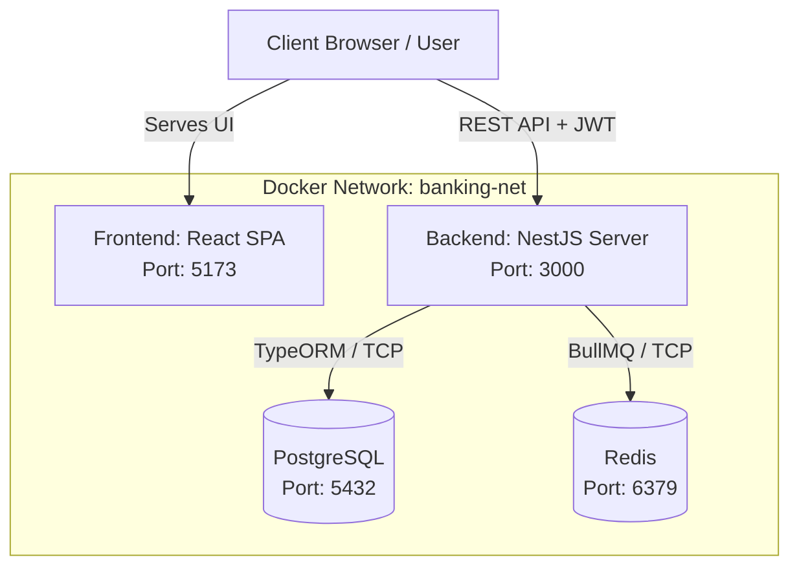
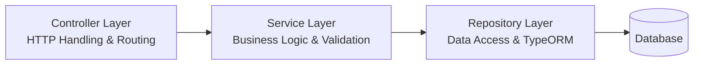
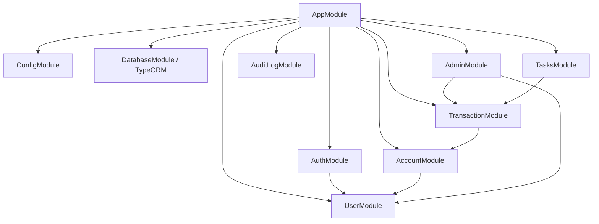
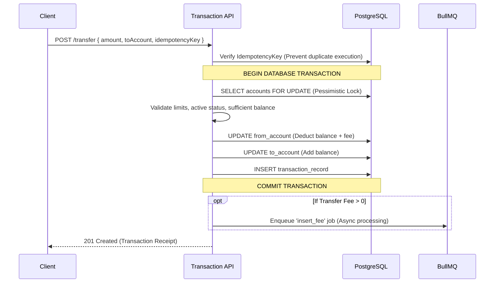
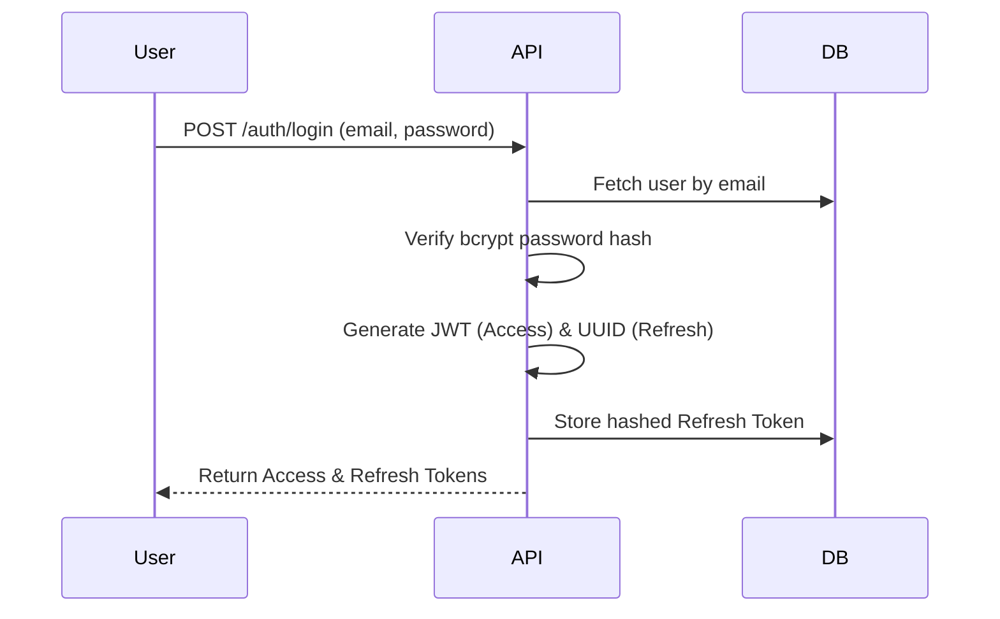

# System Architecture & Design Document

> **Simple Banking App**  
> Version: 1.0.0 | Status: Active | Last Updated: 2026-07-07

---

## 1. Executive Summary

**Simple Banking App** is a secure, internal banking system designed to handle core financial operations including account management, internal transfers, deposits, withdrawals, and administrative monitoring. 

The system follows a robust **Client-Server RESTful Architecture**, utilizing a decoupled React frontend and a NestJS backend. It emphasizes high consistency in financial transactions (ACID properties), background job processing for auxiliary tasks, and a strict Role-Based Access Control (RBAC) security model.

---

## 2. Technology Stack

### 2.1. Core Infrastructure
| Component | Technology | Version | Description |
| :--- | :--- | :--- | :--- |
| **Frontend Framework** | React + Vite | v18+ | Single Page Application (SPA) |
| **Backend Framework** | NestJS | v10+ | Node.js modular API framework |
| **Language** | TypeScript | v5+ | Strict typing across the full stack |
| **Database** | PostgreSQL | v16 | Primary relational datastore |
| **In-Memory Cache/Queue** | Redis | v7 | Backing store for BullMQ |
| **Containerization** | Docker & Compose | — | Local development and deployment |

### 2.2. Application Libraries
| Domain | Frontend | Backend |
| :--- | :--- | :--- |
| **State Management** | Zustand (Client), TanStack Query v5 (Server) | — |
| **UI/Styling** | Ant Design v5, Tailwind CSS | — |
| **ORM / Data Access** | — | TypeORM v0.3+ |
| **Task Queue** | — | BullMQ |
| **Security & Auth** | Axios Interceptors | Passport, JWT, bcrypt |
| **Validation** | React Hook Form, Zod | class-validator, class-transformer |

---

## 3. High-Level System Architecture

The application is encapsulated within a Docker bridge network (`banking-net`). The frontend serves static assets while interacting directly with the NestJS backend via RESTful APIs. The backend orchestrates data persistence in PostgreSQL and offloads background processing to Redis via BullMQ.



---

## 4. Backend Architecture (NestJS)

The backend follows a strictly layered, domain-driven module architecture.

### 4.1. Layered Pattern


- **Controllers**: Responsible strictly for receiving HTTP requests, validating DTOs, and mapping responses. No business logic resides here.
- **Services**: Contain the core business rules. They orchestrate database transactions, queue background jobs, and enforce constraints.
- **Repositories**: Handle direct database querying and persistence.

### 4.2. Module Dependency Graph

The application is highly modularized, ensuring separation of concerns:



---

## 5. Frontend Architecture (React)

### 5.1. State Management Strategy
The frontend utilizes a bifurcated state management approach to ensure optimal performance and minimal boilerplate:
- **Server State (TanStack Query):** Handles all asynchronous data fetching, caching, background refetching, and mutations.
- **Client State (Zustand):** Manages ephemeral UI states (e.g., sidebar toggles, modal visibility) and session state (e.g., active user, JWT tokens).

### 5.2. Routing & Access Control
Routing is protected at the layout level using Higher-Order Components (HOCs).

```text
/
├── /login, /register             (Public Routes)
├── /dashboard, /accounts, ...    (Protected Routes — Customers)
├── /admin/*                      (Admin Routes — RBAC: Role = Admin)
└── /maintenance                  (System Maintenance fallback)
```

---

## 6. Transaction Processing & Concurrency

Financial integrity is the system's highest priority. The application employs **Pessimistic Locking** and **Idempotency Keys** to prevent race conditions (e.g., double spending) during concurrent transactions.

### 6.1. Internal Transfer Flow (ACID Compliant)



---

## 7. Security Architecture

### 7.1. Authentication (JWT + Opaque Tokens)
The system uses a dual-token architecture to balance security and UX:
- **Access Token (JWT):** Short-lived (15 minutes), stateless. Contains minimal user payload (ID, Role).
- **Refresh Token (Opaque UUID):** Long-lived (7 days), stateful. Stored hashed in the database. Used to securely request new Access Tokens.



### 7.2. Authorization (Guards)
NestJS Guards intercept incoming requests:
1. `JwtAuthGuard`: Validates the Bearer token signature and expiration. Attaches the `User` object to the Request.
2. `RolesGuard`: Evaluates the attached User's role against the endpoint's `@Roles()` metadata. Rejects unauthorized access with `403 Forbidden`.

---

## 8. Background Processing (Tasks Module)

Heavy operations or asynchronous follow-ups are decoupled from the main HTTP request-response lifecycle using **BullMQ**.
- **Fee Processing:** Instead of delaying the client's transfer request with multiple DB inserts for system fee collection, the `insert_fee` job is queued and processed asynchronously by a background worker.
- **Resilience:** BullMQ handles retries, delays, and backoff strategies for failed jobs.

---

## 9. Logging & Auditing

The `AuditLogModule` tracks critical system events (e.g., Admin actions, security events).
- Logs include: `action_type`, `user_id`, `ip_address`, `entity_type`, `entity_id`, and a JSON snapshot of the `changes`.
- These logs are immutable and provide a secure trail for compliance and debugging.
