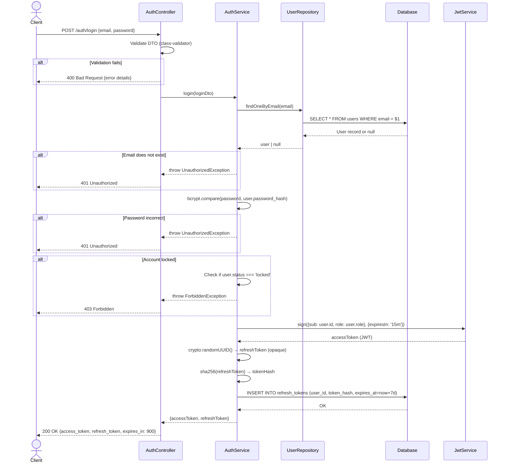
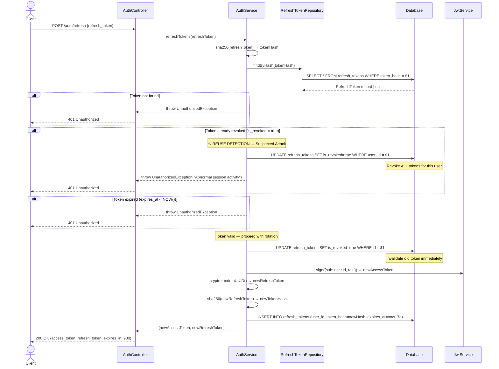
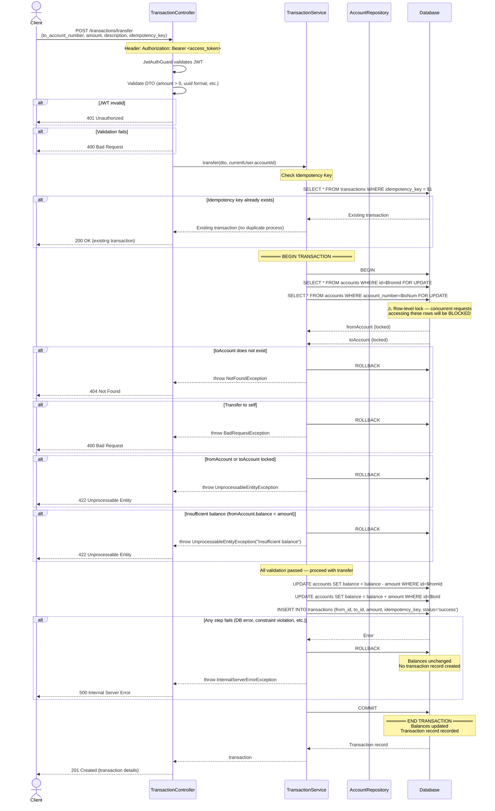
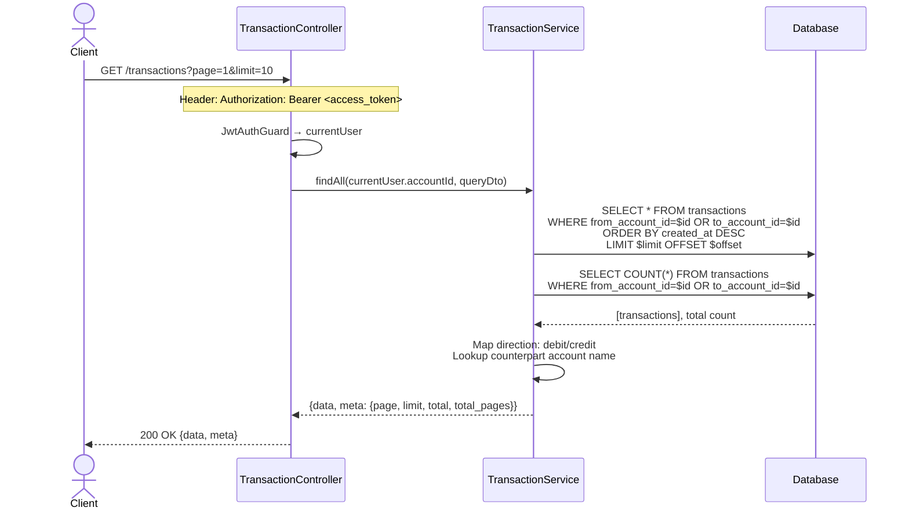
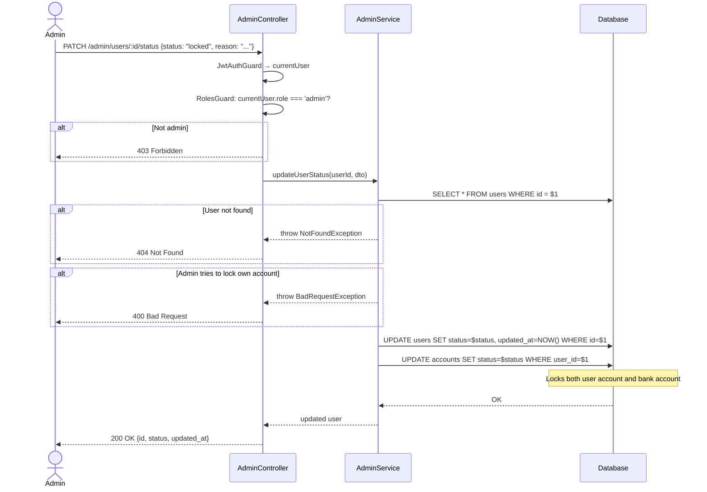

# Sequence Diagrams — Simple Banking App

> This document describes the step-by-step processing flows for the main business operations,
> showing interactions between: **Client**, **Controller**, **Service**, **Repository**, and **Database**.

---

## 1. Login Flow (Login + JWT)

---

## 2. Refresh Token Rotation Flow

---

## 3. Internal Transfer Flow (with Database Transaction)

---

## 4. Retrieve Transaction History Flow (Paginated)

---

## 5. Admin Lock Account Flow

