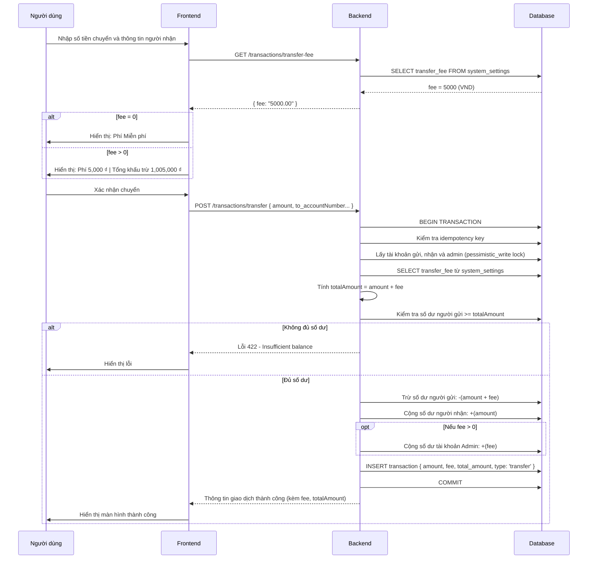

# Sơ Đồ Luồng Xử Lý Chuyển Tiền

Dưới đây là sơ đồ luồng xử lý chuyển tiền sau khi bổ sung chức năng phí giao dịch (phí được chuyển cho tài khoản admin).

```mermaid
sequenceDiagram
    participant User as Người dùng
    participant FE as Frontend
    participant BE as Backend
    participant DB as Database

    User->>FE: Nhập số tiền chuyển và thông tin người nhận
    FE->>BE: GET /transactions/transfer-fee
    BE->>DB: SELECT transfer_fee FROM system_settings
    DB-->>BE: fee = 5000 (VND)
    BE-->>FE: { fee: "5000.00" }
    
    alt fee = 0
        FE->>User: Hiển thị: Phí Miễn phí
    else fee > 0
        FE->>User: Hiển thị: Phí 5,000 ₫ | Tổng khấu trừ 1,005,000 ₫
    end

    User->>FE: Xác nhận chuyển
    FE->>BE: POST /transactions/transfer { amount, to_accountNumber... }
    BE->>DB: BEGIN TRANSACTION
    
    BE->>DB: Kiểm tra idempotency key
    BE->>DB: Lấy tài khoản gửi, nhận và admin (pessimistic_write lock)
    BE->>DB: SELECT transfer_fee từ system_settings
    
    BE->>BE: Tính totalAmount = amount + fee
    BE->>DB: Kiểm tra số dư người gửi >= totalAmount
    
    alt Không đủ số dư
        BE-->>FE: Lỗi 422 - Insufficient balance
        FE->>User: Hiển thị lỗi
    else Đủ số dư
        BE->>DB: Trừ số dư người gửi: -(amount + fee)
        BE->>DB: Cộng số dư người nhận: +(amount)
        
        opt Nếu fee > 0
            BE->>DB: Cộng số dư tài khoản Admin: +(fee)
        end
        
        BE->>DB: INSERT transaction { amount, fee, total_amount, type: 'transfer' }
        BE->>DB: COMMIT
        BE-->>FE: Thông tin giao dịch thành công (kèm fee, totalAmount)
        FE->>User: Hiển thị màn hình thành công
    end
```
